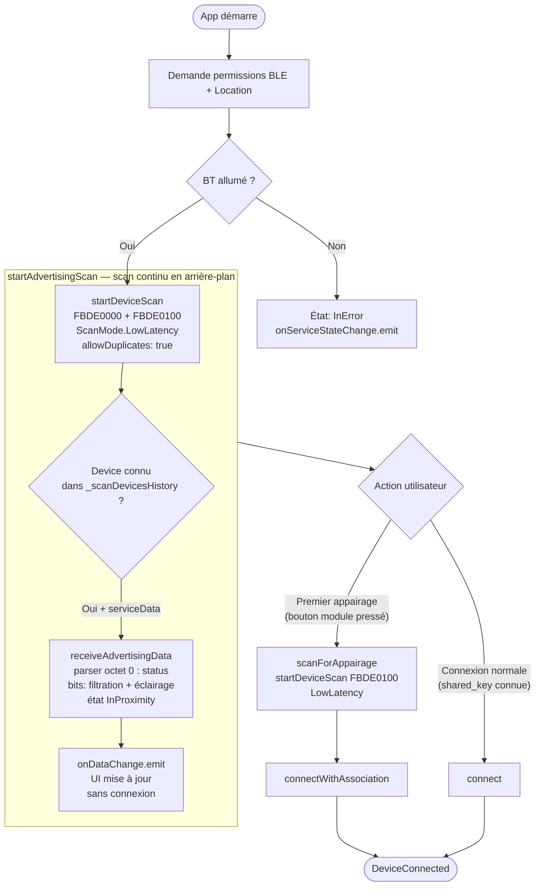

# JS — Activité globale (Android app)

> Source : `one/decompiled_js/Bluetooth/BleNetworkManager.js`  
> Référence : `BleNetworkState = { Nothing, Scanning, DeviceInAssociationProcess, DeviceInConnectionProcess, DeviceConnected }`

