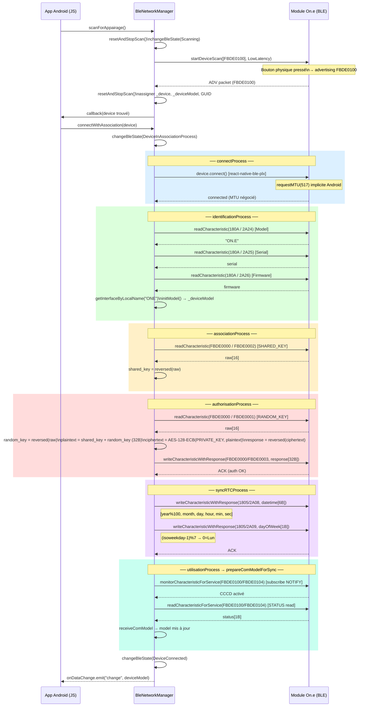

# JS — Séquence appairage (`connectWithAssociation`)

> Source : `one/decompiled_js/Bluetooth/BleNetworkManager.js` — méthode `connectWithAssociation`  
> Appelé uniquement quand le bouton physique du module est pressé (advertising FBDE0100).

