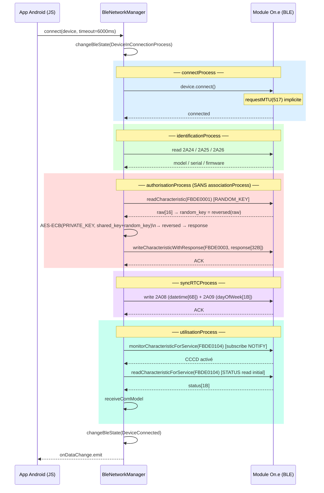

# JS — Séquence connexion normale (`connect`)

> Source : `one/decompiled_js/Bluetooth/BleNetworkManager.js` — méthode `connect`  
> Utilisé pour toutes les reconnexions après un appairage initial réussi (shared_key connue).  
> **Différence clé vs appairage : pas d'`associationProcess` (pas de lecture FBDE0002).**

