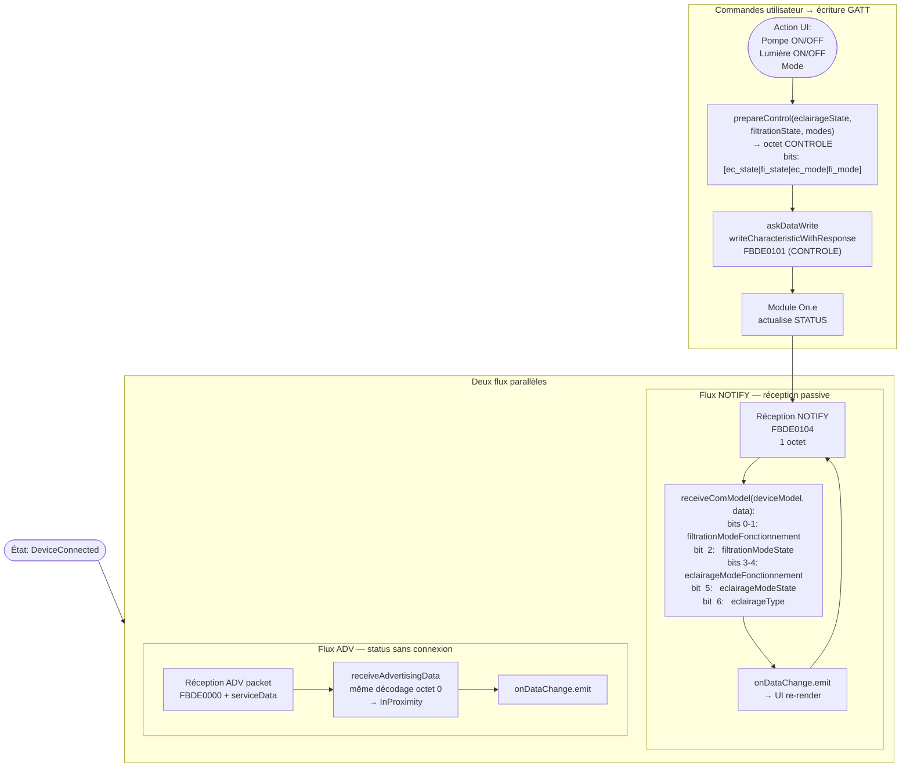

# JS — Activité données en régime établi

> Source : `one/decompiled_js/Bluetooth/BleNetworkManager.js` — `askDataSubscribe`, `askDataWrite`  
> Source : `one/decompiled_js/One/One/OneInterface.js` — `receiveComModel`, `prepareControl`

