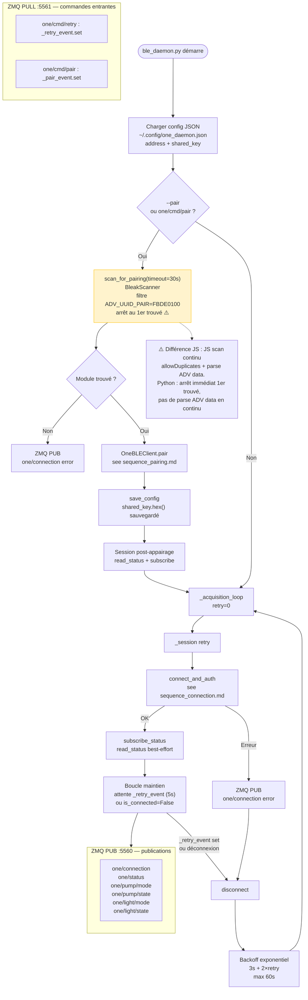

# Python — Activité globale (ble_daemon.py)

> Source : `ble_daemon.py` — classe `OneDaemon._acquisition_loop()`  
> Comparaison JS : [01_activity_global.md](../js/01_activity_global.md)

### Différences notables vs JS
| Point | JS | Python |
|---|---|---|
| Scan arrière-plan | Continu, parse ADV data → status sans connexion | Absent — statut uniquement via connexion GATT |
| Arrêt scan appairage | Timeout ou 1er trouvé | 1er trouvé (event set) ✅ conforme |
| Reconnexion | `reset()` → relance immédiate | Backoff exponentiel 3–60s |
| Publication état | `onDataChange.emit` → UI | ZMQ PUB → web_server, homebridge, etc. |
