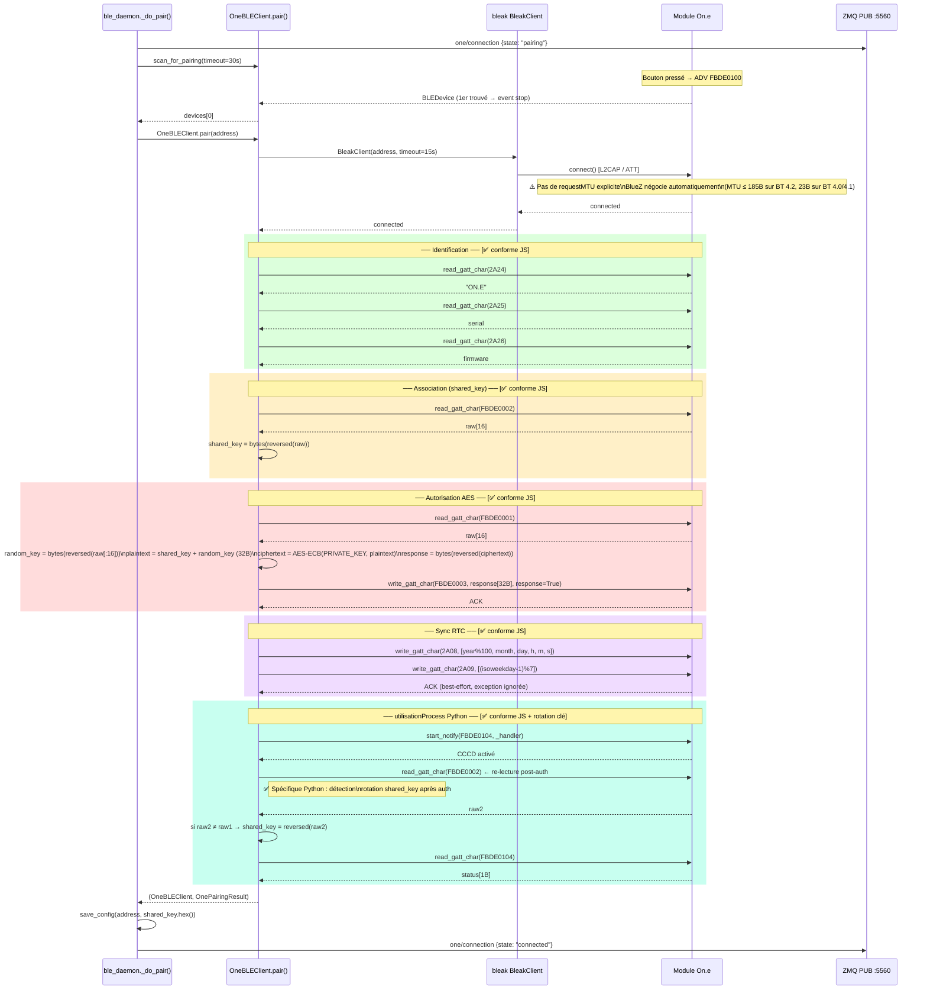

# Python — Séquence appairage (`OneBLEClient.pair`)

> Source : `one/one_ble.py` — méthode `OneBLEClient.pair()`  
> Comparaison JS : [02_sequence_pairing.md](../js/02_sequence_pairing.md)

### Conformité vs JS
| Étape | JS | Python | Écart |
|---|---|---|---|
| Scan | `startDeviceScan` LowLatency | `BleakScanner` + event | ✅ Équivalent |
| requestMTU | Implicite Android ≥517B | Non fait (BlueZ auto) | ℹ️ Sans impact pour 1-32B |
| Identification | 2A24/25/26 | Idem | ✅ |
| SHARED_KEY (FBDE0002) | `reversed(raw)` | `bytes(reversed(raw))` | ✅ |
| AES handshake | ECB(PRIV, sk+rk) reversed | Idem | ✅ |
| Sync RTC | year%100, 6B + 1B | Idem | ✅ |
| subscribe FBDE0104 | `monitorCharacteristic` | `start_notify` | ✅ |
| read STATUS | `readCharacteristic` | `read_gatt_char` | ✅ |
| Re-lecture FBDE0002 | ❌ Absent | ✅ Ajouté | ✅ Python plus robuste |
