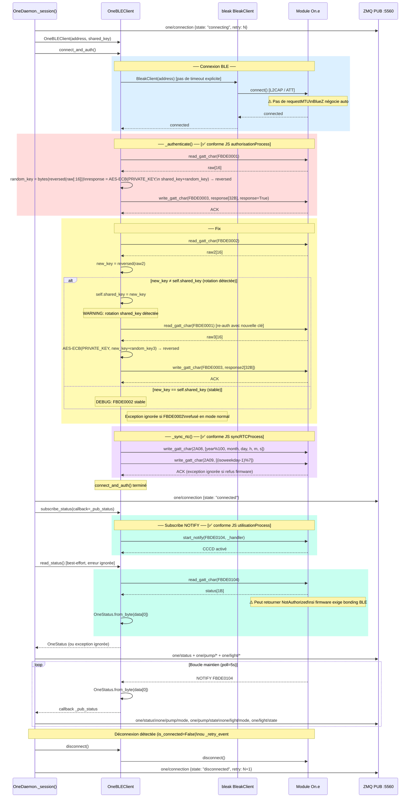
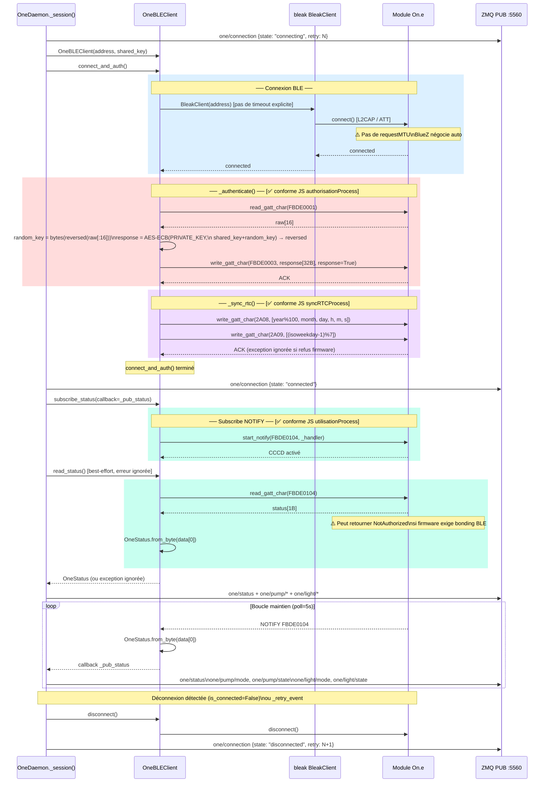

# Python — Séquence connexion normale (`connect_and_auth`)

> Source : `one/one_ble.py` — méthodes `connect_and_auth()`, `_authenticate()`, `_sync_rtc()`  
> Comparaison JS : [03_sequence_connection.md](../js/03_sequence_connection.md)  
> **Fix #1 appliqué le 2026-07-05** : re-lecture FBDE0002 post-auth.

### Conformité vs JS — état après Fix #1

| Étape JS | Implémenté Python | Statut |
|---|---|---|
| identificationProcess (read 2A24/25/26) | ❌ Absent en mode normal | ℹ️ Mineur |
| authorisationProcess (FBDE0001→0003) | ✅ `_authenticate()` | ✅ |
| **Re-lecture FBDE0002 post-auth** | **✅ Fix #1 appliqué** | **✅ Corrigé** |
| syncRTCProcess | ✅ `_sync_rtc()` | ✅ |
| utilisationProcess (subscribe + read) | ✅ dans `_session()` | ✅ |

> Source : `one/one_ble.py` — méthodes `connect_and_auth()`, `_authenticate()`, `_sync_rtc()`  
> Comparaison JS : [03_sequence_connection.md](../js/03_sequence_connection.md)

### ⚠️ Différence critique identifiée vs JS — `connect` normal

| Étape JS | Implémenté Python | Risque |
|---|---|---|
| identificationProcess (read 2A24/25/26) | ❌ Absent en mode normal | ℹ️ Mineur — pas bloquant |
| authorisationProcess (FBDE0001→0003) | ✅ `_authenticate()` | OK |
| **Re-lecture FBDE0002 post-auth** | **❌ Absent dans `connect_and_auth()`** | **🔴 Critique si rotation clé** |
| syncRTCProcess | ✅ `_sync_rtc()` | OK |
| utilisationProcess (subscribe + read) | ✅ en deux temps dans `_session()` | OK |

> **Action corrective** → voir [04_diff_analysis.md](04_diff_analysis.md)
