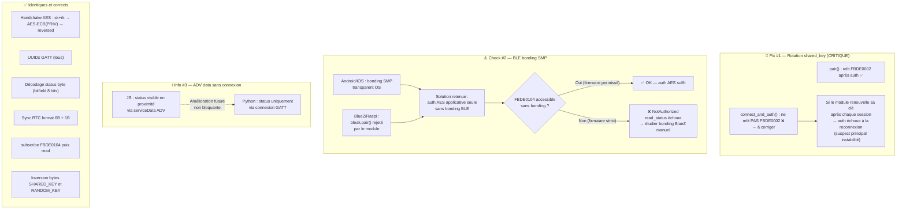

# Python vs JS — Analyse des différences et impact Bluetooth versions

> Ce document est la référence consolidée des divergences entre l'app Android (JS)  
> et l'implémentation Python headless.  
> Mis à jour à chaque correction de `one/one_ble.py`.

---

## Tableau de conformité global

| # | Étape | JS (Android) | Python (bleak/Raspi) | Impact | Statut |
|---|---|---|---|---|---|
| 1 | Scan appairage | `startDeviceScan` LowLatency, multi-devices, timeout configurable | `BleakScanner` + event stop 1er trouvé | ℹ️ Mineur | ✅ Conforme fonctionnellement |
| 2 | **Scan ADV continu** | Parse `serviceData` ADV → status InProximity *sans connexion* | **Absent** | ⚠️ Fonctionnel manquant | ❌ Non implémenté |
| 3 | **requestMTU** | Implicite Android ≥517B via react-native-ble-plx | BlueZ auto (≤185B BT4.2, 23B BT4.0) | ℹ️ Sans impact opérations 1–32B | ✅ Acceptable |
| 4 | identificationProcess | Lit 2A24/25/26 avant auth | En appairage ✅ / en connexion ❌ | ℹ️ Mineur | ⚠️ Partiel |
| 5 | associationProcess (FBDE0002) | En appairage uniquement | Idem | ✅ | ✅ Conforme |
| 6 | authorisationProcess AES | FBDE0001 → AES-ECB → FBDE0003 | Idem | ✅ | ✅ Conforme |
| 7 | syncRTCProcess | 2A08 (6B year%100) + 2A09 (1B) | Idem | ✅ | ✅ Conforme |
| 8 | utilisationProcess (subscribe+read) | `monitorCharacteristic` puis `readCharacteristic` | `start_notify` puis `read_gatt_char` | ✅ | ✅ Conforme |
| 9 | **Re-lecture FBDE0002 post-auth** | ❌ Absent JS | En `pair()` ✅ / **en `connect_and_auth()` ✅ Fix #1 2026-07-05** | 🔴→✅ | ✅ Corrigé |
| 10 | **Bonding BLE SMP** | OS transparent (Android/iOS) | `bleak.pair()` appelé **après** AES auth ✅ Fix #2 2026-07-05 | ⚠️→✅ | ✅ Corrigé |
| 11 | Boucle reconnexion | `reset()` + relance immédiate | Backoff exponentiel 3–60s | ℹ️ Politique différente | ✅ Acceptable |

---

## Diagramme des risques

---

## Impact Bluetooth 4 vs 5

| Aspect | BT5 (Android/iOS + module) | BT4.1 (Raspi 3B BCM43438) | Conclusion |
|---|---|---|---|
| MTU max | 517B (Android LE) | 23B (BT4.0) à 185B (BT4.2 DLE) | ℹ️ Sans impact opérations actuelles (≤32B) |
| LE Data Length Extension | Oui | Non (BT4.1) | ℹ️ Idem |
| Scan LowLatency | 100% duty cycle | ~1.28s intervalle (BlueZ passif) | ℹ️ Légère latence détection |
| Bonding SMP | Transparent OS | `bleak.pair()` problématique | ⚠️ Voir Check #2 |
| NOTIFY FBDE0104 | Bonding requis (couche BLE) | Auth AES suffisante ? | ⚠️ Dépend firmware |

> Le Raspi 3B utilise le chip **BCM43438** qui supporte Bluetooth 4.1.  
> Le Raspi 4 utilise le **BCM4345** (BT5.0 partiel). Si instabilité persistante, envisager Raspi 4.

---

## Actions correctives

### Fix #1 — Re-lecture FBDE0002 après auth dans `connect_and_auth()` ✅ APPLIQUÉ 2026-07-05
**Fichier** : `one/one_ble.py`  
**Méthode** : `connect_and_auth()`  
**Commit** : `fix(ble): re-read FBDE0002 post-auth in connect_and_auth to detect shared_key rotation`

### Check #2 — Bonding BLE SMP ✅ APPLIQUÉ 2026-07-05
**Observation** : `NotAuthorized` sur 2A08 (RTC) et FBDE0104 (STATUS) confirmé par les logs.
**Cause** : BlueZ ne déclenche pas le SMP automatiquement contrairement à Android/iOS.
**Fix** : `pair()` appelé dans `connect_and_auth()` APRES `_authenticate()`.  
**Commit** : `fix(ble): add BLE SMP pair() after AES auth in \`connect_and_auth\` to fix NotAuthorized on FBDE0104`

### Amélioration #3 — Parse advertising data (optionnel)
**Fichier** : `one/one_ble.py`  
**Méthode** : `scan_for_use()` — enrichir le callback avec parsing `advertisement_data.service_data`.
